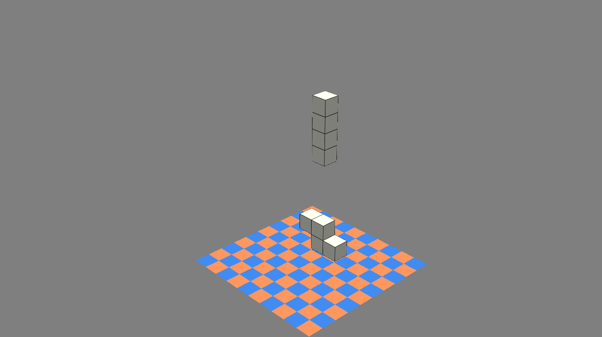

# Tetris 3D

Author: Jianxiang Li, Fengying Yang

Design: Tetris game in 3D world.

Screen Shot:

How To Play:

Use WASD keys to move the cubes around, and click mouse keys(left, middle, right) for rotation.

The goal is to fill up as many layers as possible.

Currently, it is hard to really fill a full layer with normal gameplay, so there's also a debug cheat control. By pressing space key, you can directly remove the lowest layer even though it is not filled.

Sources: 

Base assets from https://github.com/15-466/15-466-f20-base2

Cubes built with blender by Fengying.

This game was built with [NEST](NEST.md).

